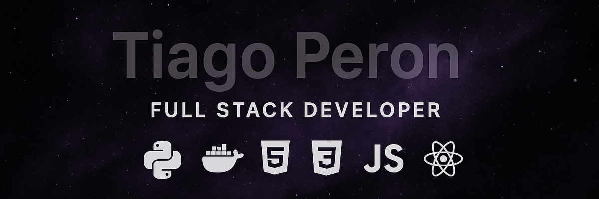

  

<h1 align="center">👋 Olá! Me chamo Tiago Peron.</h1>

  <em>Um programador estudante full stack apaixonado por python.</em>

  Sou um desenvolvedor estudante focado em aprender construir soluções eficientes. Tenho experiência em Python, Django e Docker e almejo transformar ideias em código.

- 🔭 Atualmente estou trabalhando em um projeto de **Sistema de Gestão de Estoque**.
- 🌱 Estou aprendendo **Pytho, Django, HTML, CSS, Docker, DevOps**.
- 👯 Procuro colaborar em **Projetos web full stack**.
- ⚡ Curiosidade: **Adoro ciência e tecnologia.**

---

<h2 align="left">🛠️ Tech Stack</h2>

  
  
  
  

---

<h2 align="left">📊 Minhas Estatísticas do GitHub</h2>

  
  

---

<h2 align="left">🚀 Projetos em Destaque</h2>

  
<strong>Project Web Cars</strong>

   
  <em>Plataforma web full-stack desenhada para servir como a vitrine digital e sistema de gestão de inventário para uma concessionária de veículos seminovos.</em>
    
  <strong>Tecnologias:</strong> [Python, Docker, Postgres]
   
  <a href="http://github.com/tperons/project-web-cars" target="_blank">🔗 Repositório</a> | 
  <a href="https://cars.tiagoperon.com.br/" target="_blank">🌐 Deploy</a>

  

---

<h2 align="left">📬 Contato</h2>

    
    
    

